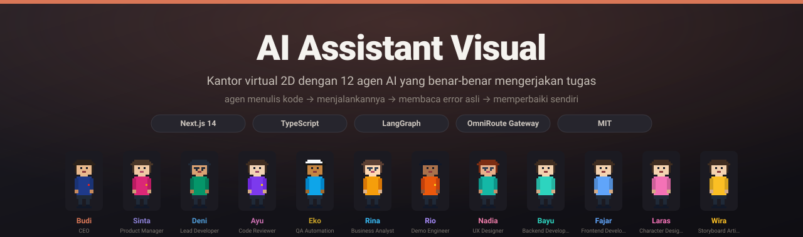

# AI Assistant Visual

### Kantor virtual 2D dengan 12 agen AI yang benar-benar mengerjakan tugas

**Agen menulis kode → menjalankannya → membaca error asli → memperbaiki sendiri.**

**Bahasa Indonesia** · [Mulai cepat](#memulai) · [Arsitektur](#arsitektur) · [Lisensi](LICENSE) · [Kontribusi](CONTRIBUTING.md)

---

  

---

## Apa ini?

Bayangkan sebuah perusahaan perangkat lunak dengan **12 anggota tim**, masing-masing
dengan spesialisasi dan wewenang berbeda. Mereka duduk di kantor virtual 2D — bisa
berjalan, duduk di kursi, berdiskusi di ruang rapat, dan kembali ke meja masing-masing.

Anda cukup mengetik **satu baris brief** untuk memulai. Tim menyusun requirement,
merancang arsitektur, menulis program, **menjalankannya**, menguji, dan menulis
dokumentasi — semuanya **satu per satu sesuai peran**, bukan sekadar chatbot yang
menjawab pertanyaan.

Yang membedakannya dari sekadar "AI yang menulis kode":

- 🏃 **Kode benar-benar dijalankan** — Python, JavaScript, TypeScript, C++, C, Java, PHP.
- 🧯 **Error asli dikembalikan ke agen** — agen membaca `stderr`, lalu memperbaiki sendiri.
- 📦 **Library dipasang otomatis** — `pip` (venv) & `npm`, sesuai kebutuhan program.
- 📁 **Hasil kerja = file nyata** — tersimpan di folder proyek, bukan cuma diskusi.
- 🧠 **Ingat antar-task** — setiap task menyimpan kesimpulan untuk task berikutnya.
- 🛠️ **Tool CRUD per agen** — baca, tulis, ubah, hapus file di folder kerjanya.

## Daftar isi

| Bagian | Isi |
|---|---|
| [Tampilan antarmuka](#tampilan-antarmuka) | Tangkapan visual dashboard & Workspace |
| [Demo langsung](#demo-langsung) | Animasi kantor virtual (GIF + SVG) |
| [Kantor virtual](#kantor-virtual) | Denah, ruangan, dan 12 agen |
| [Cara kerjanya](#cara-kerjanya) | 6 fase, loop per task, tool agen |
| [Arsitektur](#arsitektur) | Diagram berlapis & struktur folder |
| [Memulai](#memulai) | Prasyarat, instal, konfigurasi, jalankan |
| [Variabel lingkungan](#variabel-lingkungan) | Semua env yang dipakai |
| [Keamanan](#keamanan) | Mitigasi eksekusi program |
| [Pengujian & pengembangan](#pengujian--pengembangan) | Skrip test & pipeline |
| [Kredit & kolaborasi](#kredit--kolaborasi) | Karya pihak lain yang kami hormati |
| [Lisensi](#lisensi) | MIT + pengecualian |
