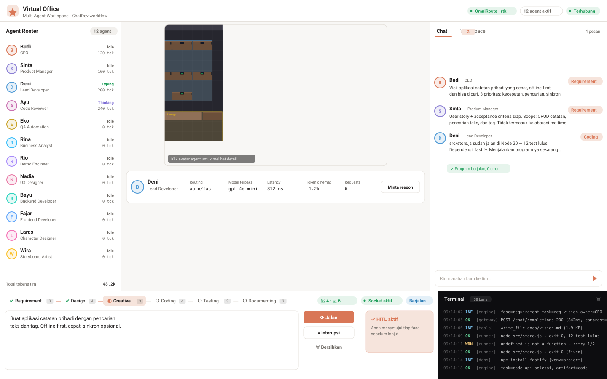
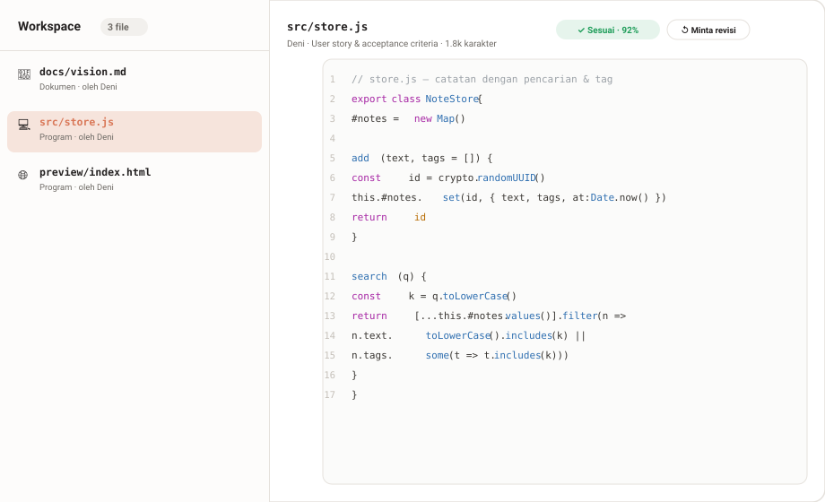
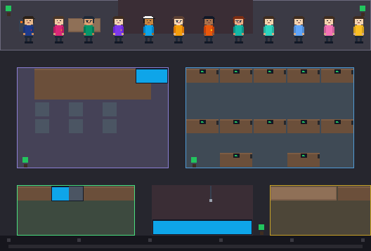
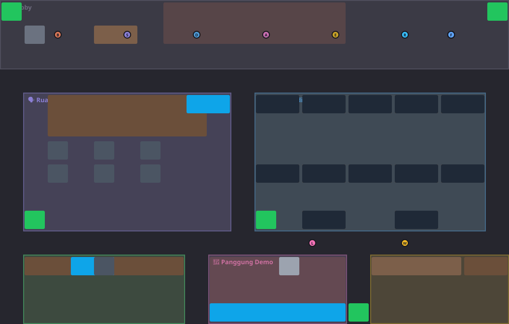
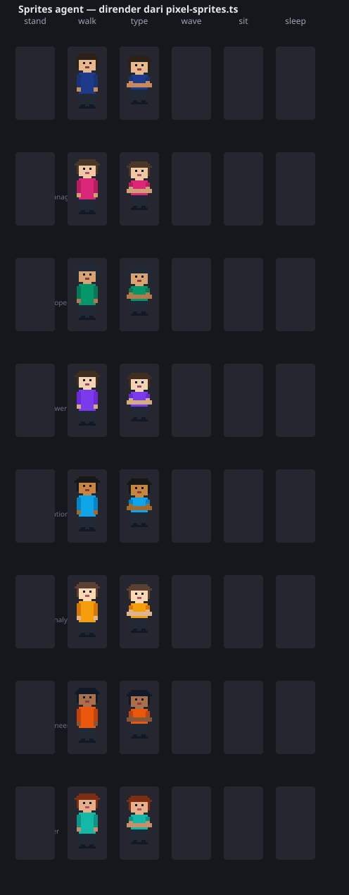
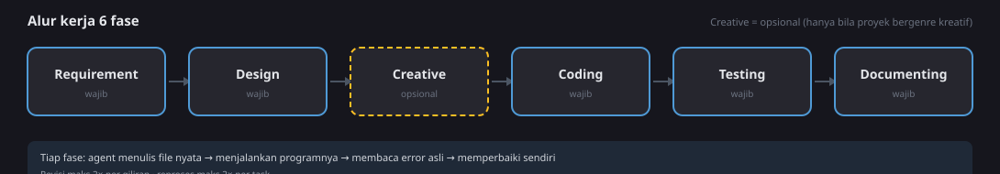
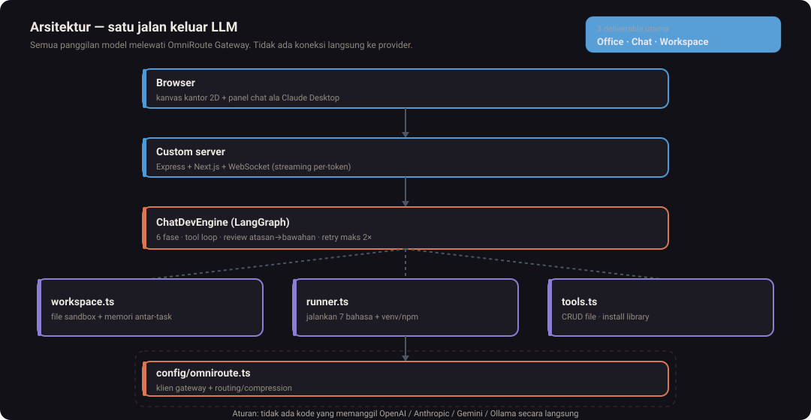

<div align="center">

# AI Assistant Visual

### Kantor virtual 2D dengan 12 agen AI yang benar-benar mengerjakan tugas

**Agen menulis kode → menjalankannya → membaca error asli → memperbaiki sendiri.**

[](https://nextjs.org/)
[](https://www.typescriptlang.org/)
[](https://langchain-ai.github.io/langgraph/)
[](LICENSE)
[](tests/)
[](https://omniroute.ai)

**Bahasa Indonesia** · [Mulai cepat](#memulai) · [Arsitektur](#arsitektur) · [Lisensi](LICENSE) · [Kontribusi](CONTRIBUTING.md)

</div>

---

<p align="center">
  
</p>

---

## Apa ini?

Bayangkan sebuah perusahaan perangkat lunak dengan **12 anggota tim**, masing-masing
dengan spesialisasi dan wewenang berbeda. Mereka duduk di kantor virtual 2D — bisa
berjalan, duduk di kursi, berdiskusi di ruang rapat, dan kembali ke meja masing-masing.

Anda cukup mengetik **satu baris brief** untuk memulai. Tim menyusun requirement,
merancang arsitektur, menulis program, **menjalankannya**, menguji, dan menulis
dokumentasi — semuanya **satu per satu sesuai peran**, bukan sekadar chatbot yang
menjawab pertanyaan.

Yang membedakannya dari sekadar "AI yang menulis kode":

- 🏃 **Kode benar-benar dijalankan** — Python, JavaScript, TypeScript, C++, C, Java, PHP.
- 🧯 **Error asli dikembalikan ke agen** — agen membaca `stderr`, lalu memperbaiki sendiri.
- 📦 **Library dipasang otomatis** — `pip` (venv) & `npm`, sesuai kebutuhan program.
- 📁 **Hasil kerja = file nyata** — tersimpan di folder proyek, bukan cuma diskusi.
- 🧠 **Ingat antar-task** — setiap task menyimpan kesimpulan untuk task berikutnya.
- 🛠️ **Tool CRUD per agen** — baca, tulis, ubah, hapus file di folder kerjanya.

## Daftar isi

| Bagian | Isi |
|---|---|
| [Tampilan antarmuka](#tampilan-antarmuka) | Tangkapan visual dashboard & Workspace |
| [Demo langsung](#demo-langsung) | Animasi kantor virtual (GIF + SVG) |
| [Kantor virtual](#kantor-virtual) | Denah, ruangan, dan 12 agen |
| [Cara kerjanya](#cara-kerjanya) | 6 fase, loop per task, tool agen |
| [Arsitektur](#arsitektur) | Diagram berlapis & struktur folder |
| [Memulai](#memulai) | Prasyarat, instal, konfigurasi, jalankan |
| [Variabel lingkungan](#variabel-lingkungan) | Semua env yang dipakai |
| [Keamanan](#keamanan) | Mitigasi eksekusi program |
| [Pengujian & pengembangan](#pengujian--pengembangan) | Skrip test & pipeline |
| [Kredit & kolaborasi](#kredit--kolaborasi) | Karya pihak lain yang kami hormati |
| [Lisensi](#lisensi) | MIT + pengecualian |

---

## Tampilan antarmuka

Satu layar berisi tiga hal sekaligus: **kantor virtual** tempat 12 agen bergerak
sesuai pekerjaannya, **chat** tempat Anda melihat dan mengarahkan mereka, dan
**Workspace** berisi file nyata yang mereka hasilkan.

<p align="center">
  
</p>

<details>
<summary><b>Workspace</b> — hasil kerja tiap agent, dikelompokkan per task (klik untuk memperbesar)</summary>

<p align="center">
  
</p>

</details>

> Semua gambar di README ini **dirender dari kode** oleh `npm run docs:images`,
> bukan file desain manual. Sprite agent berasal dari `components/office/pixel-sprites.ts`,
> denah kantor dari `types/office.ts`. Ubah kodenya → jalankan ulang skrip → gambar ikut akurat.

---

## Demo langsung

<p align="center">
  
</p>

GIF di atas dirender frame-per-frame dari sprite yang sama dengan yang dipakai
runtime. Untuk versi vektor (bisa dizoom tanpa pecah):

<p align="center">
  
</p>

---

## Kantor virtual

Grid kantor berukuran **22 × 14 tile** (1 tile = 48 px, total 1056 × 672 px).
Geometri kantor seluruhnya ada di satu file: `types/office.ts`. Tabel
`WORKSTATIONS` di sana juga menjadi sumber meja di kanvas, jadi kursi, monitor,
dan posisi berdiri agent tidak mungkin melenceng satu piksel pun.

<p align="center">
  
</p>

### Ruangan

| Ruangan | Emoji | Ukuran (tile) | Aktivitas | Siapa kerja di sini |
|---|---|---|---|---|
| Lobby | 🚪 | 22 × 3 | santai | Agen yang sedang tidak mendapat task |
| Ruang Rapat | 🗣️ | 9 × 6 | diskusi | CEO, PM, BA — ada 6 kursi, mereka benar-benar **duduk** |
| Ruang Coding | 💻 | 10 × 6 | kerja | Lead Dev, Backend, Frontend, Code Reviewer |
| Lab QA | 🧪 | 7 × 3 | menguji | QA Automation |
| Panggung Demo | 🎤 | 6 × 3 | demo | Demo Engineer, UX Designer, tim kreatif |
| Lounge | ☕ | 6 × 3 | santai | Agen yang selesai fase sebelumnya |

### 12 agen

Setiap agen punya **guard** — batas kewenangan yang menghentikan role-nya. Inilah
yang mencegah QA ikut menulis kode produksi, atau CEO ikut merancang arsitektur detail.

| Agen | Peran | Ruangan (dari aktivitas) | Fokus | Dilarang |
|---|---|---|---|---|
| 👔 Budi | CEO | Ruang Rapat | Visi, prioritas, keputusan akhir | Menulis kode, menyusun test |
| 📋 Sinta | Product Manager | Ruang Rapat | User story, acceptance criteria, scope | Menulis kode, memilih stack |
| 📊 Rina | Business Analyst | Ruang Rapat | Analisis kebutuhan, risiko, validasi | Menulis kode, arsitektur teknis |
| 👨‍💻 Deni | Lead Developer | Ruang Coding | Arsitektur & implementasi utama | Menyusun skenario test |
| ⚙️ Bayu | Backend Developer | Ruang Coding | API, model data, logika server | Menggambar komponen visual |
| 🖥️ Fajar | Frontend Developer | Ruang Coding | Komponen UI, state klien, API binding | Mendesain skema basis data |
| 🔍 Ayu | Code Reviewer | Ruang Coding | Review kode, risiko, handoff teknis | Menulis kode fitur baru |
| 🧪 Eko | QA Automation | Lab QA | Skenario uji, kasus tepi | Menulis kode fitur produksi |
| 🎨 Rio | Demo Engineer | Panggung Demo | Alur layar, prototipe, skrip demo | Logika bisnis backend |
| 🎨 Nadia | UX Designer | Panggung Demo | Journey, design token, aksesibilitas | Logika server, menjalankan test |
| 🎨 Laras | Character Designer | Ruang Coding | Desain tokoh SVG, color palette | Struktur cerita, storyboard |
| 🎬 Wira | Storyboard Artist | Panggung Demo | Shot list, panel storyboard SVG | Desain karakter, arsitektur |

<details>
<summary>Sprite agent — dirender dari <code>pixel-sprites.ts</code> (klik untuk memperbesar)</summary>

<p align="center">
  
</p>

</details>

---

## Cara kerjanya

Alur kerja bukan satu prompt panjang ke satu model. Ia adalah **graph 6 fase**
(`@langchain/langgraph`) di mana tiap fase menjalankan task-task paralel dan
**tiap task hanya boleh diambil satu agent dengan peran yang cocok**.

<p align="center">
  
</p>

### 6 fase, 20 task

| Fase | Task | Pemilik | Hasil kerja (deliverable) |
|---|---|---|---|
| **Requirement** | `req-vision` | CEO | Visi produk & prioritas |
| | `req-spec` | Product Manager | User story + acceptance criteria |
| | `req-analysis` | Business Analyst | Analisis kebutuhan & risiko |
| **Design** | `design-arch` | Lead Developer | Dokumen arsitektur teknis |
| | `design-risk` | Code Reviewer | Review risiko arsitektur |
| | `design-ux` | Demo Engineer | Rancangan alur layar |
| | `design-system` | UX Designer | Design token & sistem visual |
| **Creative** *(opsional)* | `creative-character` | Character Designer | Desain karakter (SVG) |
| | `creative-storyboard` | Storyboard Artist | Panel storyboard (SVG) |
| | `creative-narrative` | Storyboard Artist | Struktur cerita tiga akt |
| **Coding** | `code-impl` | Backend Developer | Kode server yang benar-benar dijalankan |
| | `code-frontend` | Frontend Developer | Kode klien yang benar-benar dijalankan |
| | `code-review` | Code Reviewer | Catatan review kode |
| | `code-ui` | Demo Engineer | Prototipe tampilan |
| **Testing** | `test-plan` | QA Automation | Rencana pengujian |
| | `test-verify` | Business Analyst | Validasi kesesuaian requirement |
| | `test-demo` | Demo Engineer | Skrip demo |
| **Documenting** | `doc-guide` | Product Manager | Panduan produk |
| | `doc-release` | CEO | Catatan rilis & metrik |
| | `doc-handoff` | Code Reviewer | Catatan technical handoff |

> **Fase `creative` hanya jalan bila brief-nya memang bergenre kreatif**
> (cerita, karakter, game, animasi, novel, storyboard…). Tanpa gerbang ini,
> setiap proyek backend biasa akan sia-sia menggambar karakter sekaligus membakar
> kuota gateway — tapi terlalu ketat, proyek berisi kata "game" akan terlewat.

### Yang terjadi di dalam satu task

```text
1. DISPATCH   agent pemilik task berjalan ke ruangan kegiatannya
              (pathfinding A* menghindari meja, sofa, dan mesin kopi)
2. PROMPT     system prompt + guard (mandate/can/cannot) + blok skill
              + konteks file rekaan + memori task sebelumnya
3. NULIS      model menulis; blok  file:<path>  diekstrak lalu disimpan
              ke folder task — inilah hasil kerjanya, bukan sekadar chat
4. VALIDASI   pemeriksaan lokal: panjang isi, code fence tertutup, ada/tidaknya
              placeholder, dan acceptance criteria per task -> "sesuai" / "perlu-revisi"
5. JALANKAN   (hanya peran teknis) agent memanggil tool run_program,
              membaca stdout/stderr ASLI, memasang library bila kurang
6. PERBAIKI   agent memperbaiki kodenya berdasarkan error tersebut, lalu mengulang
7. REVIEW     atasan menilai hasilnya; bila belum sesuai -> permintaan revisi
8. INGAT      hasil disimpan sebagai artefak di Workspace + ringkasan ke memori
              untuk disuntikkan ke task berikutnya
```

### Batas yang mencegah alur berputar tanpa henti

| Batas | Nilai | Alasan |
|---|---|---|
| Agent paralel per fase | 3 (`MAX_PARALLEL`) | Gateway tidak kewalahan, tapi tetap terlihat paralel |
| Putaran tool per giliran | 4 | Cukup untuk baca → jalan → baca error → perbaiki |
| Revisi per giliran | 2 | Satu giliran boleh diperbaiki berkali-kali |
| Reprokses per task | 2 | Setelah 2× masih belum sesuai, hasil diterima & ditandai di log |
| `while (true)` | 10 detik/langkah, 25 detik/program | Program tidak boleh menggantung |

### Tool yang boleh dipanggil agent

Delapan tool, sengaja dibatasi — setiap tool berarti kemampuan menjalankan
sesuatu di mesin ini, jadi menambah tool berarti menambah permukaan serangan.

| Tool | Kegunaan |
|---|---|
| `list_files` | Lihat isi folder kerja, termasuk file milik rekaan |
| `read_file` | Baca isi file sebelum menyunting pekerjaan orang lain |
| `list_tasks` | Lihat folder tiap task + file yang sudah ditulis tiap agent |
| `write_file` | Buat file baru (gagal bila sudah ada) |
| `edit_file` | Timpa / tambahkan isi file yang sudah ada |
| `delete_file` | Hapus file yang tidak terpakai |
| `run_program` | **Jalankan program, kirim balik stdout + stderr asli** |
| `install_library` | Pasang paket `pip` (venv) atau `npm`, tebak ecosystem dari nama |

### Bahasa yang bisa dijalankan

| Bahasa | Ekstensi | Cara jalan |
|---|---|---|
| Python | `.py`, `.pyw` | Interpreter **venv proyek** (bukan `python` global) |
| JavaScript | `.js`, `.mjs`, `.cjs` | Binary Node yang sedang berjalan |
| TypeScript | `.ts`, `.tsx` | `node node_modules/tsx/dist/cli.mjs` |
| C++ | `.cpp`, `.cc`, `.cxx` | `g++ -o … -std=c++17` → jalankan |
| C | `.c` | `gcc -o …` → jalankan |
| Java | `.java` | `javac` → `java -cp` |
| PHP | `.php` | `php` |

Bahasa dua langkah (compile → jalankan) punya alasan: program yang gagal compile
berhenti di langkah pertama, sehingga agent melihat **error compile asli**, bukan
error "exe tidak ada" yang membingungkan.

---

## Arsitektur

<p align="center">
  
</p>

### Lapisan

| Lapisan | Isi | Peran |
|---|---|---|
| **Antarmuka** | `app/`, `components/` | Kanvas kantor 2D, roster, chat, Workspace, bar workflow (React + Tailwind + Radix + Zustand) |
| **Transport** | `server/`, `app/api/` | Custom server Node yang menyatukan Next.js **dan** WebSocket pada satu port |
| **Orkestrasi** | `lib/orchestrator/` | LangGraph, registry task, runner, tool, sandbox, validasi |
| **Model** | `config/`, `lib/orchestrator/llm.ts` | Semua panggilan LLM lewat **OmniRoute** — tidak ada koneksi langsung ke provider |
| **Pengetahuan** | `lib/skills/`, `server/skills/` | Skill agent (satu folder per skill, masing-masing punya `SKILL.md`) |

Aturan main yang dijaga: **tidak ada kode server yang bocor ke bundel browser**.
`config/routing.ts` sengaja tidak meng-import `openai` dan tidak membaca
`process.env`, karena konstanta routing juga dipakai komponen client. Module
client-safe (`defaults.ts`, `taskRegistry.ts`, `types/`) dipisah dari module
server-only (`ChatDevEngine.ts`, `llm.ts`, `runner.ts`).

### Struktur folder

```text
app/                     Halaman + route handler Next.js (App Router)
├─ api/
│  ├─ chat/              Completion tunggal lewat OmniRoute
│  ├─ health/            Status aplikasi + konektivitas gateway
│  ├─ models/            Katalog strategi routing + model terpakai
│  ├─ agents/config/     Konfigurasi model per agent
│  ├─ workflow/start/    Jalankan workflow sinkron (untuk skrip / non-UI)
│  └─ workspace/         CRUD & unduh file hasil kerja
├─ globals.css  layout.tsx  page.tsx

components/
├─ OfficeDashboard.tsx   Komponen root: kanvas + roster + chat + workspace
├─ office/               Kanvas 2D, pathfinding, sprite pixel-art, penggambar
├─ chat/                 Chat bergaya Claude + parser Markdown + viewer artefak
├─ panels/               Roster, prompt HITL, log terminal, bar workflow
└─ ui/                   Komponen dasar (button, dialog, tabs, toast, …)

config/
├─ omniroute.ts          Server-only: klien, header routing, health check
└─ routing.ts            Client-safe: katalog strategi + model ID

lib/
├─ orchestrator/
│  ├─ ChatDevEngine.ts   Otak: alur fase, tool loop, review, HITL, event
│  ├─ graph.ts           Graph LangGraph (satu node per fase)
│  ├─ taskRegistry.ts    20 task + deliverable + prompt output
│  ├─ runner.ts          Menjalankan program (sandbox, timeout, blocklist)
│  ├─ tools.ts           8 tool agent + eksekusinya
│  ├─ workspace.ts       Akses filesystem tersandbox
│  ├─ llm.ts / mock.ts   Streaming via OmniRoute + fallback simulasi offline
│  ├─ hierarchy.ts       Atasan menilai hasil bawahan
│  ├─ validation.ts      Kesesuaian isi file vs acceptance criteria
│  ├─ quality.ts         Mutu bentuk file (panjang, fence, placeholder)
│  ├─ pdf.ts             Markdown → PDF
│  ├─ websearch.ts       Riset internet tanpa API key
│  └─ defaults.ts        Roster 12 agent (data statis, aman untuk client)
├─ skills/               Loader + penyusun skill untuk agent
├─ server/               Penyimpan konfigurasi routing per agent
├─ store.ts              State Zustand sisi browser
└─ useOfficeSocket.ts    Klien WebSocket + reconnen

server/
├─ bootstrap.ts          Memuat .env.local, lalu start server
├─ index.ts              Custom server: Next.js + WebSocket satu port
├─ websocket.ts          Handler /socket/office (multi-sesi)
└─ skills/               Skill agent (satu folder per skill)

tests/                   Skrip test
tools/                   Generator gambar dokumentasi (SVG + GIF) dari kode
types/                   Kontrak tipe bersama (agent, office)
docs/images/             Aset visual hasil render — diperbarui lewat npm run docs:images
workspace/               Hasil kerja agent (diabaikan git)
```

### Alur satu permintaan

```text
Browser ──ws──▶ /socket/office ──▶ ChatDevEngine
   ▲                                    │
   │                                    ├─▶ LangGraph: fase → task → agent pemilik
   │                                    ├─▶ OmniRoute (auto/smart | fast | cheap | offline)
   │                                    ├─▶ tool: run_program / install_library / CRUD file
   │                                    └─▶ filesystem tersandbox di workspace/projects/
   │
   └──── OfficeEvent (SNAPSHOT, PHASE_CHANGE, AGENT_*, ARTIFACT, HITL_REQUEST, …)
```

### Endpoint

| Method | Path | Fungsi |
|---|---|---|
| GET | `/api/health` | Status aplikasi + konektivitas gateway |
| GET | `/api/models` | Strategi routing, model terpakai, status gateway |
| GET/POST | `/api/agents/config` | Konfigurasi routing per agent |
| POST | `/api/workflow/start` | Jalankan workflow penuh secara sinkron (tanpa UI) |
| POST | `/api/chat` | Completion tunggal lewat OmniRoute |
| GET | `/api/workspace/files` | Daftar file, folder task, dan memori proyek |
| GET/PUT/POST/DELETE | `/api/workspace/file` | Baca, tulis, hapus, unduh file hasil kerja |

### WebSocket `/socket/office`

| Arah | Isi |
|---|---|
| Client → server | `start` · `hitl` · `interrupt` · `update_agents` · `nudge` · `revise` · `review_peer` · `ping` |
| Server → client | `HELLO` · `SNAPSHOT` · `PHASE_CHANGE` · `AGENT_MOVE_TO_ROOM` · `AGENT_APPROACH` · `AGENT_ACTIVITY` · `AGENT_THINKING` · `AGENT_TALKING` · `AGENT_MESSAGE` · `AGENT_STREAM_CHUNK` · `AGENT_DONE` · `ARTIFACT` · `LOG` · `HITL_REQUEST` · `WORKFLOW_DONE` · `ERROR` |

Setiap koneksi = satu sesi workflow dengan engine-nya sendiri, dan memutus koneksi
otomatis membatalkan workflow yang sedang berjalan agar tidak sia-sia.

### Struktur hasil kerja di disk

```text
workspace/
├─ .active-project            penanda proyek aktif (bertahan saat restart)
├─ .active-task               penanda task aktif
└─ projects/<nama-proyek-xxx>/
   ├─ catatan-umum.md
   └─ tasks/
      ├─ req-vision/docs/product-vision.pdf
      ├─ design-arch/docs/arsitektur.md
      └─ code-impl/src/index.ts
```

Tiap task punya folder sendiri, jadi hasil kerja satu fase tidak tercampur dengan
fase lain. Deliverable bertanda PDF disimpan sebagai **PDF biner sungguhan**
(dikonversi dari Markdown), sedangkan sisanya berupa kode atau Markdown sesuai
permintaan task.

---

## Memulai

### Prasyarat

| Kebutuhan | Wajib? | Keterangan |
|---|---|---|
| **Node.js 20+** (teruji sampai v24) | ✅ | Runtime aplikasi + custom server |
| **npm** | ✅ | Instalasi dependensi |
| **[OmniRoute AI Gateway](https://omniroute.ai)** | ⭕ | Lintas model. Tanpa ini aplikasi tetap jalan dalam **mode simulasi** |
| Python 3 | ⭕ | Runner `.py` dan `pip install` (venv) |
| `g++` / `gcc` | ⭕ | Runner C++ / C |
| JDK (`javac`, `java`) | ⭕ | Runner `.java` |
| PHP | ⭕ | Runner `.php` |

Aplikasi menolak menjalankan program bila runtime-nya tidak ada, dan **menyampaikan
itu ke agent sebagai pesan jelas** — bukan diam-diam menandai "sukses".

### Instalasi

```bash
git clone https://github.com/afprayogi/virtual-office-assistant-prototype.git
cd virtual-office-assistant-prototype
npm install

# PowerShell
Copy-Item .env.example .env.local
# bash / zsh
cp .env.example .env.local
```

Buka `.env.local`, lalu isi API key gateway:

```env
OMNIROUTE_BASE_URL=http://localhost:20128/v1
OMNIROUTE_API_KEY=api-key-omniroute-anda
```

### Jalankan

```bash
npm run dev              # mode pengembangan, hot reload → http://localhost:3000
```

```bash
npm run build && npm start   # mode produksi
```

`npm start` melakukan preflight: kalau `.next/BUILD_ID` belum ada, server berhenti
dengan pesan yang jelas alih-alih gagal dengan error Next.js yang membingungkan.
Aplikasi dimuat lewat `.env.local` oleh `server/bootstrap.ts` — `tsx` sendiri
tidak memuat file env secara otomatis.

### Cek apakah sudah hidup

```powershell
Invoke-RestMethod http://localhost:3000/api/health
```

```json
{
  "ok": true,
  "app": "Virtual Office Multi-Agent Workspace",
  "socket": "/socket/office",
  "gateway": { "reachable": true, "baseUrl": "http://localhost:20128/v1" },
  "mode": "live (OmniRoute)",
  "uptimeSeconds": 42
}
```

Saat `reachable: false`, aplikasi otomatis turun ke mode simulasi: semua agent
tetap bergerak, berbicara, dan menulis file — hanya isi jawabannya yang disimulasikan
lokal. Cocok untuk demo UI tanpa menyiapkan gateway sama sekali.

### Menjalankan workflow tanpa UI

```powershell
$body = @{ task = 'Buat aplikasi catatan-taking sederhana'; hitl = $false } | ConvertTo-Json
Invoke-RestMethod -Method Post http://localhost:3000/api/workflow/start `
  -ContentType 'application/json' -Body $body
```

Respons berisi ringkasan per fase, daftar file yang dihasilkan, dan pemakaian token
seluruh agent. Semua file nyata ada di `workspace/projects/`.

### Tips

- **Mulai dari brief yang jelas.** Satu baris berisi tujuan, fitur utama, dan batasan.
- **Aktifkan HITL** bila ingin menyetujui tiap fase secara manual.
- **Klik artefak di Workspace** untuk meminta revisi ke agent pembuatnya — catatannya
  diteruskan langsung ke prompt revisi.
- **Klik avatar agent** untuk melihat routing, penggunaan token, dan task yang sedang dikerjakan.
- Ganti model per agent lewat dropdown di sidebar, atau lewat `POST /api/agents/config`.

---

## Variabel lingkungan

Semua konfigurasi ada di `.env.local` (lihat [`.env.example`](.env.example)).

| Variabel | Default | Keterangan |
|---|---|---|
| `OMNIROUTE_BASE_URL` | `http://localhost:20128/v1` | Endpoint gateway (OpenAI-compatible). Fallback: `LLM_BASE_URL` |
| `OMNIROUTE_API_KEY` | `omni-local` | API key **gateway**. Fallback: `LLM_API_KEY` |
| `OMNIROUTE_COMPRESS` | `rtk` | Token compression: `rtk` · `caveman` · `off` |
| `OMNIROUTE_COMBO` | `auto` | Auto-fallback antar provider: `auto` · `off` |
| `PORT` | `3000` | Satu port untuk HTTP dan WebSocket |
| `HOST` | `localhost` | Host server |
| `MAX_PARALLEL` | `3` | Berapa agent boleh jalan bersamaan dalam satu fase |
| `NODE_ENV` | — | Diatur oleh `npm run dev` / `npm start` |

> `OPENAI_API_KEY`, `ANTHROPIC_API_KEY`, dan `GEMINI_API_KEY` **sengaja tidak dipakai**.
> Aplikasi ini tidak terhubung langsung ke provider mana pun — seluruh pemilihan
> model dan failover ditangani gateway.

### Strategi routing

Tiap agent punya strategi sendiri, bisa diganti dari UI:

| Strategi | Untuk siapa |
|---|---|
| `auto/smart` | Tugas berpikir tinggi — planner, arsitektur, keputusan kritis |
| `auto/fast` | Eksekusi & respons cepat — coder, eksekutor |
| `auto/cheap` | Task ringan, hemat kuota — summarizer |
| `auto/offline` | Model lokal / cache gateway |
| `pinned` | Kunci ke model ID tertentu (mis. `auto/claude-sonnet`) |

Gateway menerima strategi ini dua kali: sebagai **model ID native** di body request,
dan sebagai header `X-OmniRoute-Routing`. Mengirim dua-duanya membuat aplikasi
andal baik pada gateway yang membaca `model` maupun yang hanya membaca header.

---

## Keamanan

Aplikasi ini menjalankan kode yang ditulis model, jadi mitigasi di sini bukan
pelengkap — semuanya adalah prasyarat. Semua keputusan ada di `lib/orchestrator/`
(`runner.ts`, `workspace.ts`, `tools.ts`).

| Ancaman | Mitigasi |
|---|---|
| **Command injection** | Tidak pernah memakai `shell`. `spawn(cmd, args, { shell: false })` mengirim argv terpisah, jadi string dari model mustahil diperlakukan sebagai perintah shell |
| **Path traversal** | Semua path wajib lewat `resolveSafe()`; `../`, path absolut, dan symlink keluar sandbox **ditolak**, bukan sekadar "dibersihkan" |
| **Ingin bocor API key** | `env` program disaring hanya `PATH`, `HOME`, `SystemRoot`. `printenv` tidak menemukan kredensial |
| **Program macet / infinite loop** | Timeout keras 10 detik per langkah, 25 detik total, plus `SIGKILL` (dan `taskkill /t` di Windows) |
| **Perintah berbahaya** | Blocklist defense-in-depth: `rm -rf`, `mkfs`, `shutdown`, `curl \| sh`, `chmod 777 /`, fork bomb, dan sejenisnya |
| **Paket berbahaya** | Sanitizer nama paket: menolak yang diawali `-` (flag pip tersembunyi), `..`, operator shell, serta `virtualenv-prebuilt` yang bisa mengeksekusi `setup.py` |
| **Menjalankan proses antar agent** | Hanya peran teknis boleh memakai `run_program` / `install_library`, maksimal 4 putaran tool per giliran |
| **Menampilkan file berbahaya** | `X-Content-Type-Options: nosniff`; HTML diberi `Content-Security-Policy: sandbox allow-scripts`; PDF disajikan `inline`, file lain sebagai lampiran |
| **Input berlebihan** | Brief dibatasi 4000 karakter; output program dipotong ±8 KB agar tidak membanjiri konteks LLM |
| **Agent keluar jalur** | Guard per peran (can / cannot), atasan menilai hasil bawahan, dan batas reproses supaya alur tetap maju |

> ⚠️ **Bloklist adalah defense-in-depth, bukan sandbox sungguhan.**
> Menjalankan kode LLM dengan bloklist hanya cocok untuk mesin lokal/pribadi.
> Untuk server publik, jalankan di dalam Docker atau VM terisolasi. Jalankan
> aplikasi dengan `HOST=127.0.0.1` bila tidak butuh diakses jaringan — aplikasi
> ini tidak punya autentikasi.

---

## Pengujian & pengembangan

Tidak ada test runner eksternal — tiap file di `tests/` adalah skrip mandiri
(`tsx`) yang mencetak `✓` / `✗` dan kode keluar bukan nol bila ada yang gagal.
Alasannya: test di sini sering **menjalankan program sungguhan**, memasang paket
sungguhan, dan menulis ke filesystem sungguhan — itu yang ingin dibuktikan.

### Pipeline wajib

```bash
npm run typecheck    # tsc --noEmit
npm run test:tools   # tool agent + sandbox
npm run test:runner  # eksekusi program sungguhan
```

### Test suite lokal

Jumlah asersi di bawah hasil pengukuran di repo ini (Node 24, Windows):

| Skrip | Asersi | Yang dibuktikan |
|---|---|---|
| `npm test` | 16 | Parser Markdown, termasuk proteksi infinite loop |
| `npm run test:orchestration` | 79 | Graph, dispatch per-role, handoff antar agent, validasi, sprite |
| `npm run test:deliverables` | 29 | Semua 20 task punya deliverable; PDF benar-benar PDF valid |
| `npm run test:workspace` | 26 | Sandbox path, folder per task, pembacaan file |
| `npm run test:project` | 35 | CRUD proyek: create / overwrite / append / delete + kasus gagal |
| `npm run test:taskfolder` | 16 | Isolasi hasil kerja antar task |
| `npm run test:memory` | 15 | Ingat antar task (ringkasan → konteks task berikutnya) |
| `npm run test:deps` | 13 | Install dependency + pesan error yang bisa ditindaklanjuti |
| `npm run test:runner` | 13 | 7 bahasa dijalankan nyata, timeout, blocklist, pemotongan output |
| `npm run test:tools` | 36 | 8 tool agent, CRUD tersandbox, `npm install` nyata |
| **Total** | **278** | |

> Sebagian asersi di `test:tools` dan `test:deps` benar-benar mengunduh paket dari
> internet. Saat offline atau tanpa jaringan, hitungan itu bisa turun — itu
> keterbatasan lingkungan, bukan bug kode.

### Test yang butuh infra

| Skrip | Butuh |
|---|---|
| `npm run test:fs` | Gabungan tiga test filesystem |
| `npm run test:web` | Koneksi internet (pencarian DuckDuckGo nyata) |
| `npm run test:pdf` | Tidak ada — membuktikan file PDF hasil konversi benar-benar valid |
| `npm run test:engine` | Gateway OmniRoute aktif — smoke test dispatch + paralel |
| `npm run test:live` | Gateway OmniRoute aktif — workflow penuh, lalu membandingkan file di disk vs Workspace |
| `npm run test:e2e` | Server produksi berjalan di `TEST_BASE` (default `http://localhost:3100`) |

### Dokumentasi visual

```bash
npm run docs:images    # semua SVG + GIF dokumentasi
npm run docs:assets    # hanya aset README (hero, UI, arsitektur, demo)
```

Sprite, denah kantor, diagram alur, dan tangkapan UI **dihasilkan dari kode yang
sama dengan runtime**. Menambah agen atau mengubah denah kantor cukup
menjalankan ulang skrip ini — tidak ada gambar manual yang bisa basi.

### Mengembangkan

Baca **[CONTRIBUTING.md](CONTRIBUTING.md)** untuk gaya kode, aturan yang wajib
dijaga, dan cara menambah agen, runner, atau tool baru. Ringkasnya:

| Ingin menambah… | Sentuh |
|---|---|
| Agen baru | `lib/orchestrator/defaults.ts` → `types/office.ts` → `taskRegistry.ts` → test |
| Bahasa / runner baru | `lib/orchestrator/runner.ts` + test di `tests/runner.test.ts` |
| Tool baru | `lib/orchestrator/tools.ts` + test di `tests/tools.test.ts` |
| Skill baru | Satu folder di `server/skills/<nama>/SKILL.md` + `LICENSE.txt` |

---

## Kredit & kolaborasi

Proyek ini berdiri di atas pekerjaan orang lain. Rincian lengkap ada di
**[THIRD_PARTY_NOTICES.md](THIRD_PARTY_NOTICES.md)**.

- **[ChatDev](https://github.com/OpenBMB/ChatDev)** (OpenBMB / THUNLP, Apache-2.0) —
  paradigmanya "virtual software company": sekelompok agen yang menyelesaikan
  siklus hidup perangkat lunak lewat fase. Paper: [arXiv:2307.07924](https://arxiv.org/abs/2307.07924).
  Yang kami bangun ulang: orkestrator berbasis LangGraph, kanvas kantor virtual
  2D, dan eksekusi program nyata.
- **[Anthropic](https://www.anthropic.com)** — material skill di `server/skills/`
  dan `anthropic_skills/`. Sebagian berlisensi Apache-2.0, sebagian proprietary.
  Selalu periksa `LICENSE.txt` di dalam folder skill sebelum redistribusi.
- **[OmniRoute](https://omniroute.ai)** — AI gateway yang menjadi satu-satunya
  pintu ke semua model.
- **[LangGraph](https://langchain-ai.github.io/langgraph/)** (MIT) — orkestrasi
  fase; **[Next.js](https://nextjs.org/)** & **[React](https://react.dev/)** (MIT) — antarmuka;
  **[ws](https://github.com/websockets/ws)** (MIT) — WebSocket.

Semua sprite, denah kantor, diagram, dan tangkapan layar di README ini adalah
**aset buatan proyek ini sendiri**, dirender oleh `tools/render-docs-images.ts`
dan `tools/render-readme-assets.ts`.

---

## Kontributor

- [@afprayogi](https://github.com/afprayogi) — pemelihara

Ingin ikut membangun? Baca **[CONTRIBUTING.md](CONTRIBUTING.md)**: pipeline wajib,
aturan sandbox yang tidak boleh dilanggar, dan template Conventional Commits.

Kontribusi dalam bentuk apa pun diterima — kode, laporan bug, ide, atau perbaikan
dokumentasi. Buka issue dulu untuk fitur besar supaya tidak ada dua orang
mengerjakan hal yang sama.

---

## Lisensi

MIT — lihat [LICENSE](LICENSE).

Dengan berkontribusi, kamu setuju bahwa karyamu lisensikan di bawah MIT **dengan
pengecualian** yang tercantum di [THIRD_PARTY_NOTICES.md](THIRD_PARTY_NOTICES.md):

- Paradigma berasal dari **ChatDev** (Apache-2.0).
- Material skill milik **Anthropic, PBC** — bukan lisensi open-source.
- **OmniRoute** tunduk pada lisensinya masing-masing.
